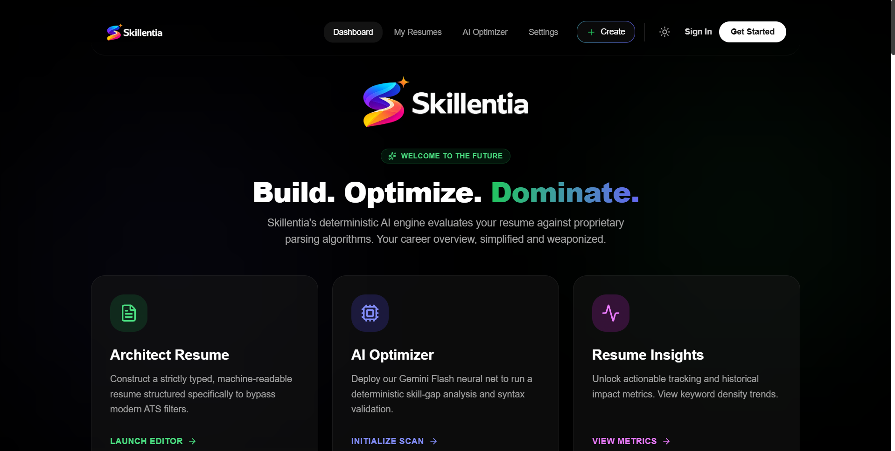
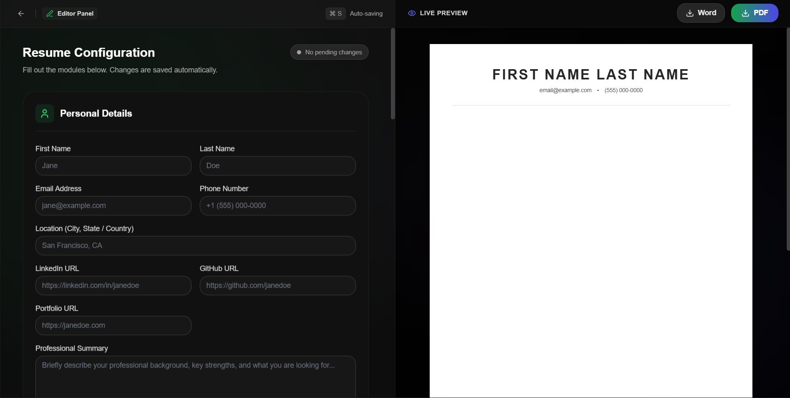
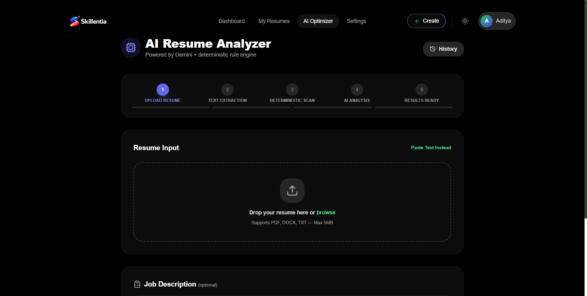
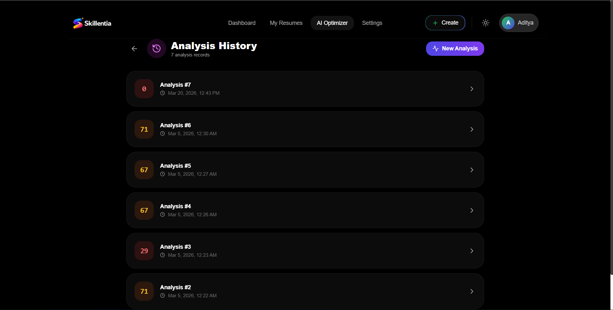

# 🚀 Skillentia – AI Resume Analyzer

Skillentia is an AI-powered resume analysis platform that evaluates resumes against job descriptions, generates ATS-based scores, identifies skill gaps, and provides actionable, role-specific improvement suggestions.

Built with a modern full-stack architecture, Skillentia focuses on delivering fast, explainable, and practical feedback to help users improve their chances of getting shortlisted.

---

## ✨ Features

* 📄 **Resume Upload & Parsing**
  Upload resumes (PDF) and extract structured content for analysis.

* 🎯 **Job Description Matching**
  Compare resumes with job descriptions to measure relevance and alignment.

* 📊 **ATS Score Breakdown**
  Generate a structured, explainable score instead of arbitrary numbers.

* 🧠 **Skill Extraction & Gap Detection**
  Identify existing skills and highlight missing, role-specific skills.

* 💡 **AI-Powered Suggestions**
  Get precise and actionable recommendations to improve resume quality.

* 🔐 **Secure Authentication (OAuth)**
  Seamless login using OAuth providers.

* ⚡ **Real-Time Analysis**
  Fast feedback with a clean and responsive UI.

---

## 🏗️ Tech Stack

### Frontend

* React.js
* Tailwind CSS

### Backend & Database

* Supabase (PostgreSQL, Auth, APIs)

### Authentication

* OAuth API (Google / GitHub login)

### AI Integration

* Gemini API

  * Resume analysis
  * Suggestions generation
  * Semantic matching

### Deployment

* Vercel

---

## ⚙️ How It Works

1. User logs in using OAuth
2. Uploads a resume (PDF)
3. (Optional) Adds a job description
4. System processes:

   * Resume parsing
   * Skill extraction
   * Semantic comparison with JD
5. Generates:

   * ATS score breakdown
   * Skill gaps
   * AI-powered suggestions

---

## 📊 ATS Scoring Parameters

Skillentia evaluates resumes based on:

* Keyword & semantic relevance
* Skill coverage
* Experience alignment
* Resume structure & clarity
* Role-specific requirements

---

## 🧪 Example Use Case

* Upload your resume
* Paste a Software Engineer job description
* Receive:

  * Match score
  * Missing skills (e.g., Docker, System Design)
  * Bullet-level improvement suggestions

---

## 📸 Screenshots

### 🔹 Home Page


### 🔹 Resume Builder Page


### 🔹 Resume Analyzer Page


### 🔹 Analysis History Page



* Resume Upload Page
* Dashboard / Analysis Results
* ATS Score Breakdown

---

## 🚀 Getting Started

```bash
# Clone the repository
git clone https://github.com/your-username/skillentia.git

# Navigate into project
cd skillentia

# Install dependencies
npm install

# Start development server
npm run dev
```

---

## 🔐 Environment Variables

Create a `.env` file and add:

```env
VITE_SUPABASE_URL=your_supabase_url
VITE_SUPABASE_ANON_KEY=your_anon_key

VITE_GEMINI_API_KEY=your_gemini_api_key

OAUTH_CLIENT_ID=your_oauth_client_id
```

---

## 🔮 Future Improvements

* AI-based resume rewriting
* Role-specific scoring models (SDE, Analyst, etc.)
* Resume version tracking
* LinkedIn profile import
* Advanced analytics dashboard

---

## 🤝 Contributing

Contributions are welcome!
Fork the repository and submit a pull request.

---

## 📬 Contact

Feel free to reach out for feedback, collaboration, or questions.

---

## ⭐ Show Your Support

If you found this project useful, consider giving it a ⭐ on GitHub!
